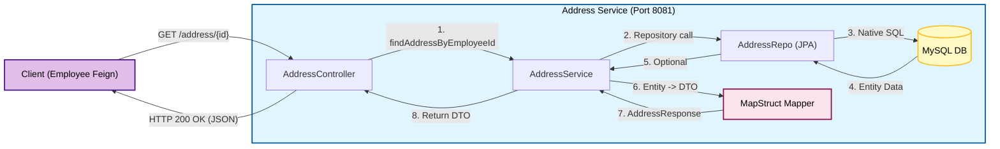
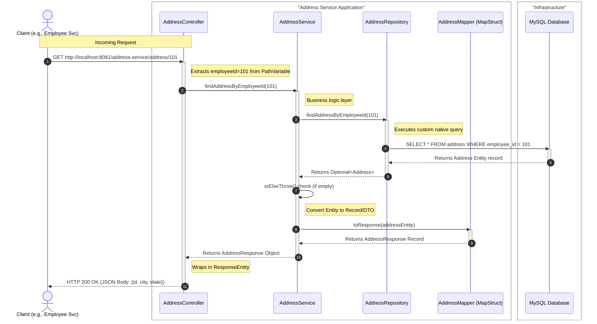

#  Spring Boot: Declarative Microservices & Automated Mapping

## Overview

This project demonstrates a clean, production-grade approach to building distributed systems. It eliminates the "boilerplate" code typically found in microservices by using declarative interfaces and automated annotation processing.

---

##  Core Technologies

### 1. Spring Cloud OpenFeign

Instead of writing complex code to manage HTTP connections, **OpenFeign** allows us to define a simple Java interface.

* **Declarative Style**: You write an interface with Spring MVC annotations (`@GetMapping`), and Feign handles the implementation, URL building, and JSON parsing.
* **Client Definition**:
```java
@FeignClient(name = "address-service", url = "http://localhost:8081")
public interface AddressClient { ... }

```


### 2. MapStruct

Manual mapping between Entities and DTOs is error-prone and tedious. **MapStruct** is an annotation processor that generates high-performance mapping code at compile time.

* **Speed**: Unlike `ModelMapper` (which uses reflection), MapStruct generates plain Java methods, making it as fast as manual code.
* **Type Safety**: If fields don't match, the project won't compile, alerting you to errors before you even run the app.

### 3. Java 25 Records

We use **Records** for `EmployeeResponse` and `AddressResponse`.

* **Immutability**: Records are final and data is immutable by default.
* **Conciseness**: No need for Lombok's `@Data` or manual Getters—Records automatically provide them.

---
This code represents a standalone microservice, the **Address Service**, responsible for managing address data. It is designed to be consumed by other services (like the `employee-service` you provided earlier) via REST APIs.

It uses Spring Boot, Spring Data JPA with MySQL, and MapStruct for DTO mapping.

Here are the architectural and sequence diagrams illustrating its internal flow when a request to fetch an address by employee ID is received.

---

### 1. High-Level Architecture Diagram

This diagram shows the components within the Address Service and how it handles incoming requests and connects to its database.

**Key Configuration Highlights:**

* **Port:** Runs on port `8081`.
* **Context Path:** All URLs start with `/address-service`.
* **Database:** Connects to a specific MySQL instance on Aiven cloud.
* **Mapping:** Uses MapStruct automatically generating implementation of mapper interfaces at compile time.



---

### 2. Sequence Diagram: Fetch Address by Employee ID Flow

This diagram details the step-by-step execution flow within the Spring Boot components when the endpoint is hit.

**Key Code Highlight:**
Notice step 4. The `AddressRepository` doesn't use standard JPA methods like `findById`. Instead, it executes a custom `@Query(nativeQuery = true, ...)` to find the address based on the *foreign key* column `employee_id`.


---

##  System Components

### `employee-service` (The Consumer)

* **`AddressClient.java`**: The Feign client that defines how to talk to the Address service.
* **`EmployeeMapper.java`**: The MapStruct interface that converts the `Employee` database entity into a clean `EmployeeResponse` record.
* **`EmployeeService.java`**: Coordinates the data fetching from the local repository and the remote Feign client.

### `address-service` (The Provider)

* **`AddressMapper.java`**: Handles the internal conversion of address entities to responses.
* **`AddressController.java`**: Exposes the `/address/{employeeId}` endpoint.

---

##  Testing the Implementation

### Step 1: Start Address Service (Port 8081)

The service will be available at `http://localhost:8081/address-service`.

### Step 2: Start Employee Service (Port 8080)

The service will be available at `http://localhost:8080/employee-service`.

### Step 3: Verify the Integrated Response

**Endpoint**: `GET http://localhost:8080/employee-service/employees/2`

**Example Response:**
```json
{
    "id": 2,
    "name": "Ashish",
    "email": "asis@gmail",
    "age": "30",
    "addressResponse": {
        "id": 2,
        "city": "BLS",
        "state": "Odisha"
    }
}
```
**Process**:

1. `EmployeeService` finds the employee in its MySQL DB.
2. **MapStruct** converts the Entity to a Record.
3. **OpenFeign** makes a background call to the Address Service on port 8081.
4. The Record is completed with address data and returned as JSON.

---

##  Build Requirements

To ensure **Lombok** and **MapStruct** work together without conflicts, the `maven-compiler-plugin` is configured with `annotationProcessorPaths`. This ensures that Lombok generates the necessary code (like constructors) *before* MapStruct tries to map the data.

---

